# How Do Senators Tweet? An EDA on Senate Twitter
Using data from `fivethirtyeight`, a dataset of tweets from senators is explored to analyze how senators use Twitter. The dataset contains over 288,000 tweets from 2008-09 to 2017-10 and has data for 100 senators. Twitter data can be difficult to clean and analyze due to how humans use Twitter to communicate. 

Since 2007 when Twitter launched, tweets could contain up to 140 characters. In 2017 this constraint was doubled, so tweets could contain up to 280 characters. This means that a lot of users would use different techniques to shorten their character count, such as using shorthand or using a series of tweets to continue a thought. Twitter users also use #hashtags and @mentions to communicate as well as link their tweets to current trends or tag users, respectively. 

This dataset is interesting because older politicians are not usually the first to adopt a new form of technology for communication, and tweeting took some time before congressional leaders were using it regularly as a platform to reach their constituents, the country, and the world.

These data will be explored, and using `textblob`, sentiment analysis is executed on the tweet set to look at sentiment trends for each party.

## The Dataset

The Twitter dataset from https://github.com/fivethirtyeight/data/blob/master/twitter-ratio/senators.csv looks like:

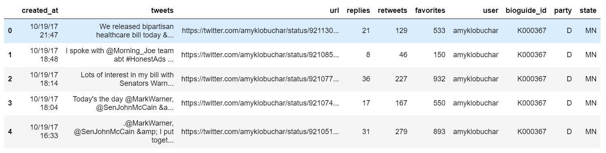

### Features and Analysis

Some of the columns were not useful in this EDA, including the `url` and `bioguide_id`. Even though the `replies`, `retweets`, and `favorites` were enticing, the main focus of this analysis involves the tweets themselves and looks at `party` and `state`.

Aside from the standard libraries used in EDA such as numpy, pandas, and matplotlib, the following were also used:

* __textblob__: For sentiment analysis

* __wordcloud__: For creating wordcloud visualizations

* __plotly__: For interactive geographical visualizations

* __nltk__: To extract stop-words

The analysis will be looking at how tweet sentiment differs between political parties. 

## Analysis

Before any analysis can happen, the tweet data needs some cleaning. As stated before, tweets are tricky due to the ever-changing landscape of human communication, misspellings, abbreviations, and using hashtags or mentions to help get their message across. So, let's talk briefly about cleaning the data and what was needed before analyzing this dataset.

#### Cleaning

---

A few transformations were needed to start an analysis. The pipeline for cleaning the dataset was as follows:

* the dates and times in the `created_at` column are turned into timestamps and used as the index for the dataframe

* apply the `lower()` method to each character in all tweets

* extract __mentions__ (ex: @realDonaldTrump) for each tweet and store them in a list as a new column in the dataframe

* extract __hashtags__ (ex: #TacoTuesday) for each tweet and store them in a list as a new column in the dataframe

* remove __mentions__ and __hashtags__ from the tweet data (more on this below)

* remove website hyperlinks from the tweet data

* remove non-alpha characters so each word only contains letters

* remove stop-words, which are common words (ex: 'a', 'there', 'and') are removed before looking at sentiment 

* cleaned tweets are split and each word stored in a list as a new column in the dataframe

---

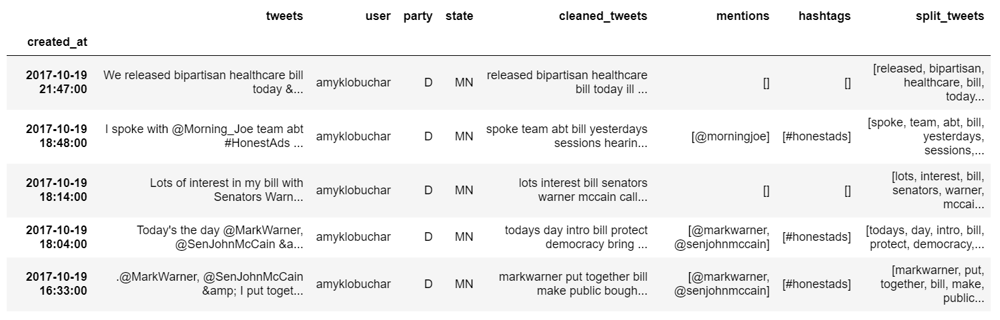

One issue mentioned above is that a lot of tweets contain misspellings and abbreviations. Common abbreviations are used to shorten the character count for a tweet, such as using w/ for the word with. After removing special characters, this will just be the letter w, which even though `with` is a stop-word, it is but one example of words that can cause issues in the cleanup and analysis.

### Who Tweets More?

Twitter usage for senators took time to ramp up, and looking at mean monthly tweet counts for all senators shows a significant increase from about 2013 and on. Half of the tweets occurred after 2014-09, as shown below.

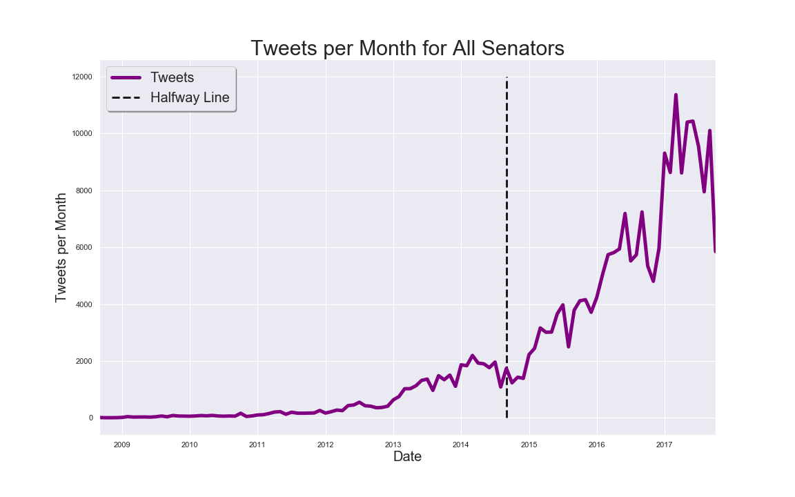

Now let's look at how often each party tweets. This will vary greatly due to how often each senator tweets, and what events are happening in their districts, nationally, or globaly. The number of tweets per some unit of time can be aggregated in differnt intervals, such as daily, weekly, monthly, or yearly. Daily and weekly look too noisy, whereas yearly isn't granular enough. So, looking at a plot of the mean tweets by each party per month looks like:

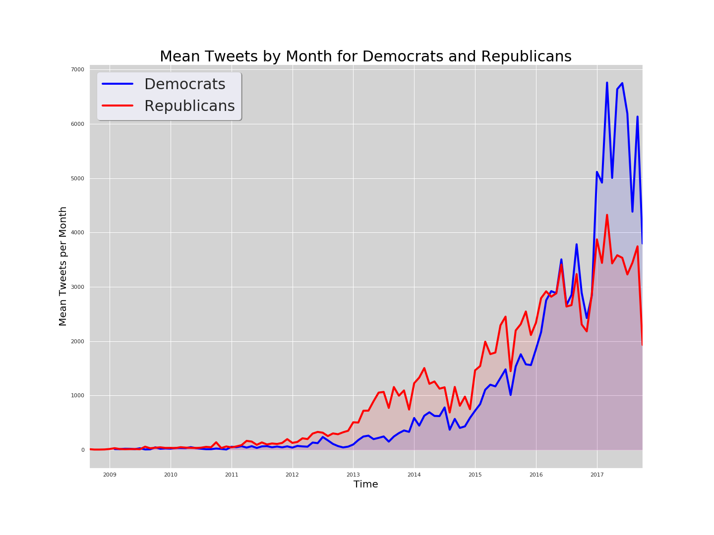

Republicans ramped up their tweet numbers until the 2016 election, where afterwards Democrats tweeted significantly more than their colleagues across the asile. 

What does this look like geographically? Each state has two senators, and they can be of either party (or a 3rd party). Let's look at how often each state tweets for each party:

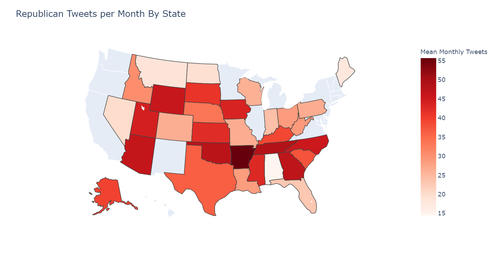

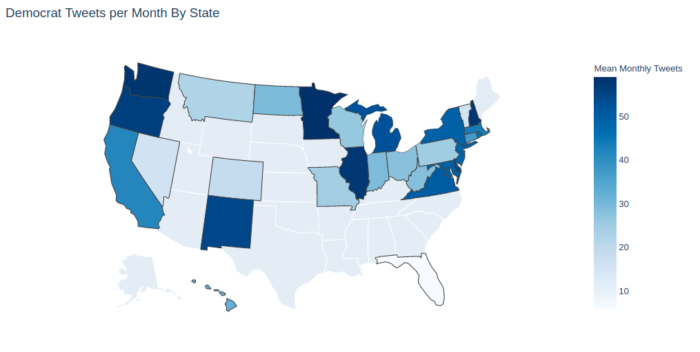

It seems pretty clear here that many states are either red or blue, and some have a mix of Republican and Democrat senators. We can see this a little more clearly by looking at all states for both parties:

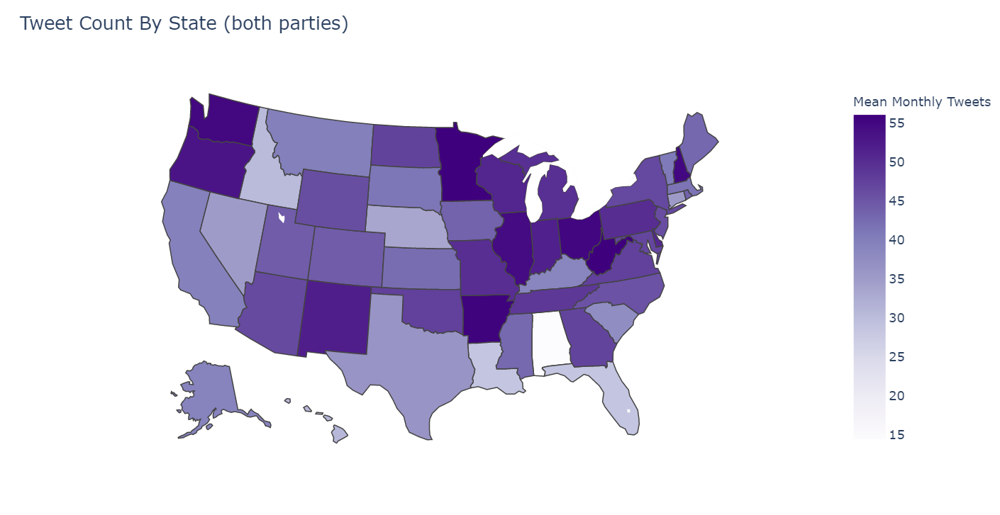

### What Are They Tweeting About?

Next we will examine the most common words tweeted by each party. Looking at dataframes for both of the two major parties (sorry Independents!) we can get a word count for all tweets and visualize this with wordclouds.

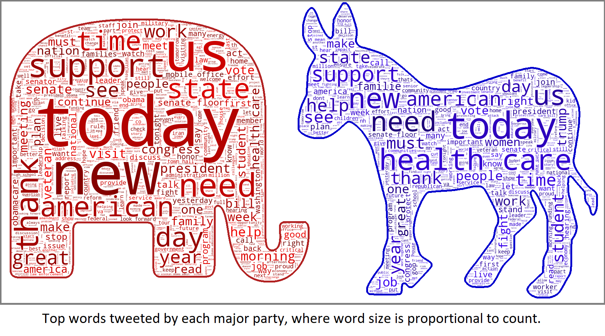

Tweeting heavily involves the use of hashtags. Hashtags act as both a way to tag a trend in both an active way (ex: "I just had 3 tacos #TacoTuesday") or passively by referencing a trend (ex: "It's Friday, why is "TacoTuesday trending on Twitter right now?"). They can also be used to convey the mood or sentiment of the user. As a separate analysis, let's look at the top hashtags using a wordcloud:

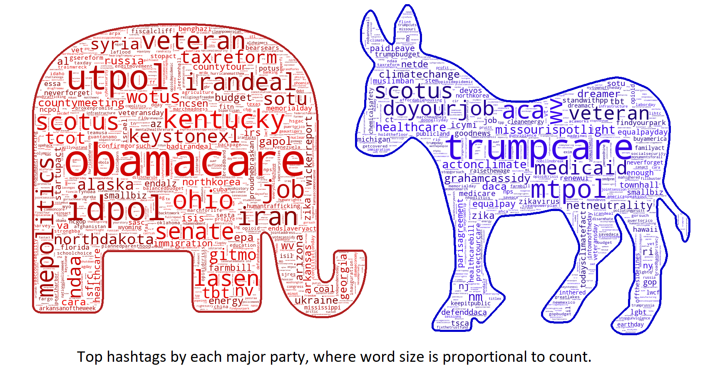

When looking at hashtags, we can see phrases better. For instance, if senators tweeted a phrase like "do your job", it would be stripped down to 'job', since both 'do' and 'your' are stop-words. And 'job' would be counted. A wordcloud would have 'job' but the meaning could easily be taken out of context. Are they tweeting about jobs or unemployment? We wouldn't know. A hashtag could be #doyourjob, which would still show up in the hashtag wordcloud (as shown above), and that gives slightly more context. So each way of looking at the tweets gives a little different information about what they were tweeting about.

### Are Their Tweets Positive, Negative, or Neutral? Sentiment Analysis

We are able to derive more meaning about what the parties are tweeting about by analyzing the sentiment of the individual tweets. Each word in the `cleaned_tweets` column are passed through `textblob` and the tweet will be given a net sentiment score which has two values:

* subjectivity: a score from 0 to 1 where 0 is very objective, and 1 is very subjective

* sentiment polarity: a score from -1 to 1 where:

$$ polarity < 0 \ (negative) $$
$$ polarity = 0 \ (neutral) $$
$$ polarity > 0 \ (positive) $$

Looking at negative, neutral, and positive, we can compare how each party tweets. This is the average for each sentiment bucket over the entire dataset:

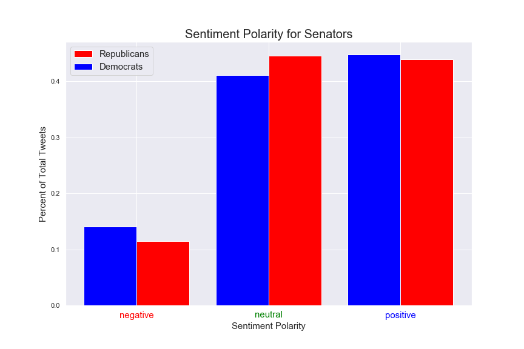

It looks like Democrats tweet more negatively and positively, whereas Republicans tweet more neturally than their respective party. Looking at a mean value across the entire dataset is not very revealing. Sentiment can reveal insights about the timeframe of the tweets on a more granular level, but even on a single day it is not uncommon for a senator to tweet both positively and negatively, such as:

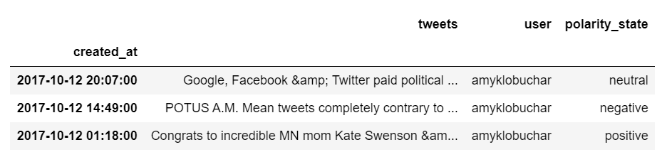

which were all tweeted consecutively in one day. Sentiment is tricky to analyze. Some examples of extreme ($p = -1.0$ and $p = 1.0$) polarity tweets:

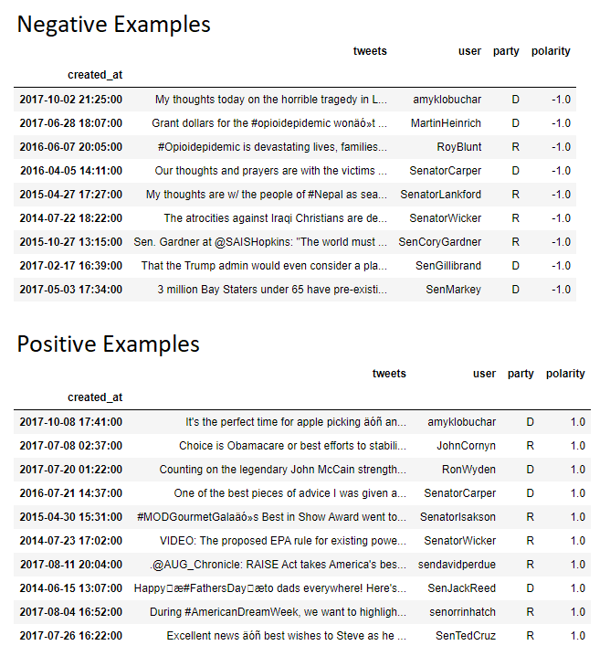

Looking at this geographically for each party looks like:

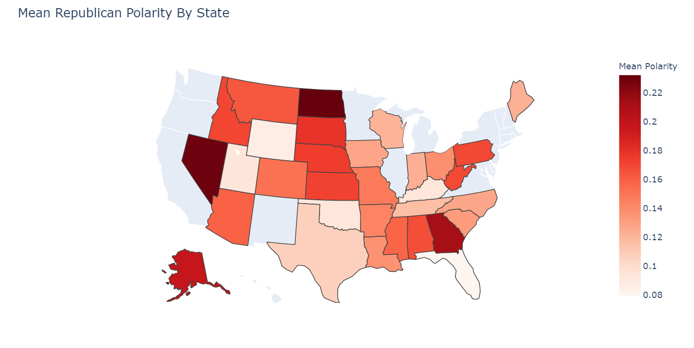

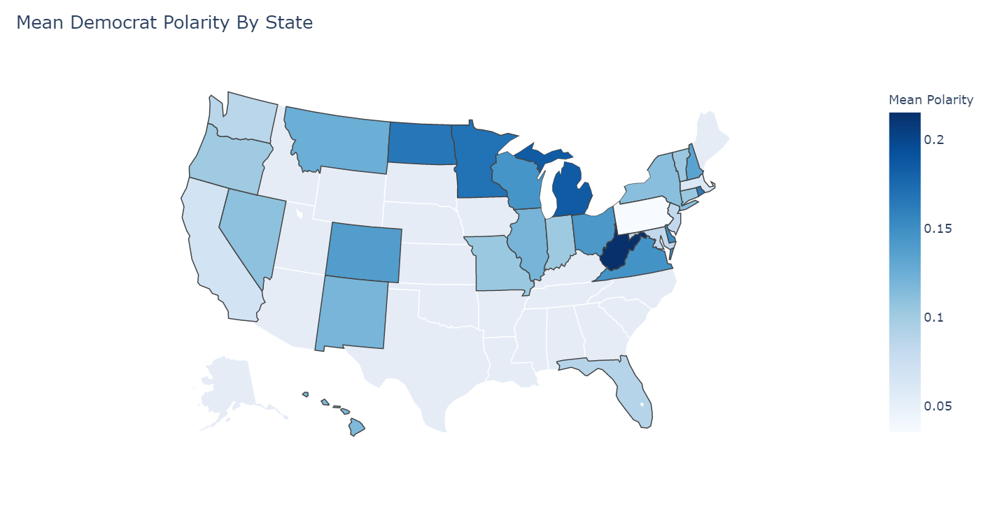

Since the mean polarity takes into account all values, all states had net positive sentiments on average. Some more than others. Looking at total sentiment of the country's senators:

We can filter for higher magnitudes of polarity for each parties. Shown below are polarities filtered to $p > 0.6$ and $p < -0.6$

## Conclusions

Sentiment analysis is useful to determine how people communicate on social media, and looking at sentiment polarity is one way to analyze the contents of a message, or groups of messages. Factors to consider when analyzing sentiment include how the polarity is aggregated, and if there are any influential political events to drive a change in sentiment. As mentioned before, this can be tricky as tweets change sentiment quickly for political tweets. 

A next step working with this dataset would be to dig deeper and do more cleaning to connect hashtags to tweets since they add to the sentiment but are more difficult to extract words from since they can be words or abbreviations smashed together.